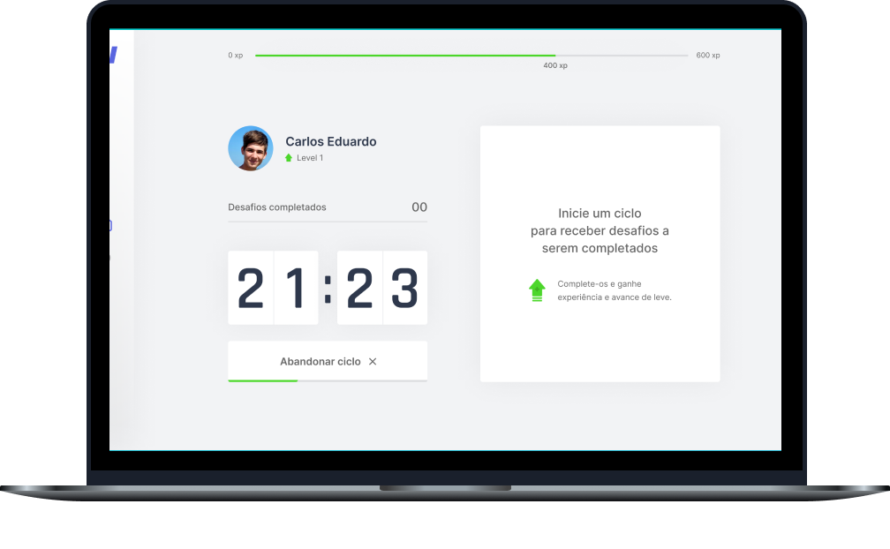

<h1 align="center">
  
</h1>

<p align="center">Exercite-se, ganhe experiência e suba de nível 🚀</p>

<h4 align="center">
  Versão 2.0
</h4>

<p align="center">
  <a href="#-sobre">Sobre</a>&nbsp;&nbsp;&nbsp;|&nbsp;&nbsp;&nbsp;
  <a href="#-tecnologias">Tecnologias</a>&nbsp;&nbsp;&nbsp;|&nbsp;&nbsp;&nbsp;
  <a href="#-layout">Layout</a>&nbsp;&nbsp;&nbsp;|&nbsp;&nbsp;&nbsp;
  <a href="#-to-do">To-Do</a>&nbsp;&nbsp;&nbsp;|&nbsp;&nbsp;&nbsp;
  <a href="#-information_source-instalação-e-uso">Instalação</a>&nbsp;&nbsp;&nbsp;|&nbsp;&nbsp;&nbsp;
  <a href="#-licença">Licença</a>
</p>

<p align="center">
  
  
  
  <a href="https://github.com/carlosmfreitas2409/nlw-04-moveit/commits/master">
    
  </a>
  
</p>

<p aling="center">
  
</p>

<p align="center">
  <a href="https://moveit-six-phi.vercel.app/" target="_blank">
    
  </a>
</p>

----

## 💡 Sobre

O Move.it é uma aplicação baseado na [Técnica de Pomodoro®](https://francescocirillo.com/pages/pomodoro-technique). Um jogo de ciclos de exercícios, para aqueles que passam muito tempo no computador, assim como eu. 😉 

Este projeto foi desenvolvido durante a 4º edição da Next Level Week (NLW), um evento realizado pela [Rocketseat](https://rocketseat.com.br). 

## 🛠️ Tecnologias

Esse projeto foi desenvolvido usando as seguintes tecnologias:

- [Next.js](https://nextjs.org/)
- [ReactJS](https://pt-br.reactjs.org)
- [Typescript](https://typescriptlang.org/)
- [NextAuth.js](https://next-auth.js.org/)
- [React Icons](https://react-icons.github.io/react-icons/)

## 🎨 Layout

Nos links abaixo você encontra o layout do projeto Web. Lembrando que você precisa ter uma conta no [Figma](https://figma.com) para acessá-lo.

- [Layout Web](https://www.figma.com/file/ge20pu3ofMOKoliUyKx1Nl/Move.it-1.0)
- [Layout Web 2.0](https://www.figma.com/file/vRbW1u0CEZuG2zE6bU5qLg/Move.it-2.0)

## 📝 To-Do

- [x] ~~Melhoria no layout~~
- [x] ~~Autenticação com Github e Google~~
- [x] ~~Armazenar dados no banco de dados~~
- [x] ~~Animação na ExperienceBar~~
- [x] ~~Animação no botão, quando estiver ativo~~
- [ ] Dark Mode
- [ ] Twitter share
- [ ] Responsividade
- [ ] Página de Leaderboard
- [ ] Animações (Framer Motion)

## :information_source: Instalação e uso

Para clonar e executar esta aplicação, você precisará do [Git](https://git-scm.com/) e [Yarn](https://yarnpkg.com/). A partir de sua linha de comando:

```bash
# Clone este repositório
$ git clone https://github.com/martins-rafael/moveIt.git

# Entre no repositório
$ cd moveIt

# Instale as dependências
$ yarn

# Rode a aplicação
$ yarn dev

# Navegue para http://localhost:3000
# A aplicação será recarregada automaticamente se você alterar qualquer um dos arquivos. 
```

## ⚙️ Como contribuir

- Faça um fork desse repositório;
- Crie uma branch com a sua feature: `git checkout -b minha-feature`;
- Faça commit das suas alterações: `git commit -m 'feat: Minha nova feature'`;
- Faça push para a sua branch: `git push origin minha-feature`;

Após o merge da sua pull request for realizado, você pode deletar a sua branch.

## 📝 Licença

Esse projeto está sob a licença MIT. Veja o arquivo [LICENSE](https://github.com/carlosmfreitas2409/nlw-04-moveit/blob/master/LICENSE) para mais detalhes.

---

<p>Feito com 💜 por Carlos Eduardo.</p>